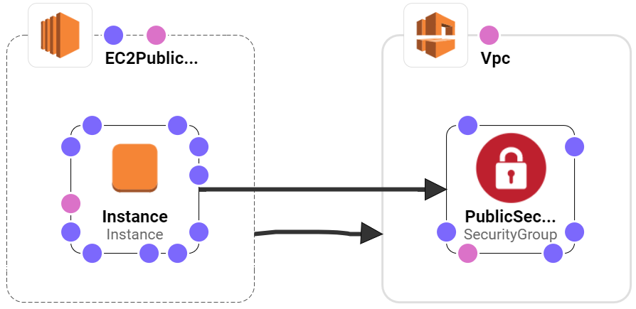
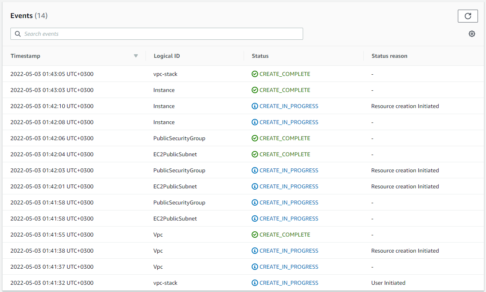
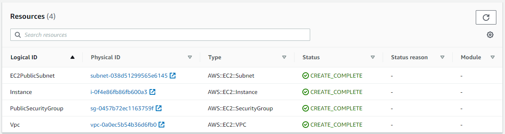

  

# Deploying AWS CloudFormation Stack using Terraform and Github Actions

## AWS CloudFormation

AWS CloudFormation enables you to create and provision AWS infrastructure deployments predictably and repeatedly. It helps you leverage AWS products such as Amazon EC2, Amazon Elastic Block Store, Amazon SNS, Elastic Load Balancing, and Auto Scaling to build highly reliable, highly scalable, cost-effective applications in the cloud without worrying about creating and configuring the underlying AWS infrastructure. AWS CloudFormation enables you to use a template file to create and delete a collection of resources together as a single unit (a stack).

## Project Architecture

## AWS CloudFormation Stack Events

## AWS CloudFormation Stack Resources

## Documentation Resources

[Terraform CloudFormation](https://registry.terraform.io/providers/hashicorp/aws/latest/docs/resources/cloudformation_stack)

[AWS CloudFormation](https://docs.aws.amazon.com/cloudformation/index.html)
