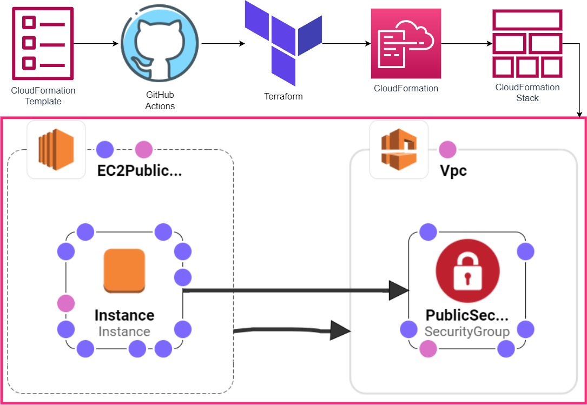

[](https://github.com/devenes/terraform-cloudformation-github-actions-vpc-ec2/actions/workflows/tf_apply.yml) [](https://github.com/devenes/terraform-cloudformation-github-actions-vpc-ec2/actions/workflows/tf_plan.yml) [](https://github.com/devenes/terraform-cloudformation-github-actions-vpc-ec2/actions/workflows/tf_destroy.yml)

# Automated Infrastructure Deployment with AWS CloudFormation, Terraform and Github Actions

Deploying new Security Group, VPC with a public subnet and a single EC2 instance in AWS CloudFormation Stack using Terraform and Github Actions.

## AWS CloudFormation

AWS CloudFormation enables you to create and provision AWS infrastructure deployments predictably and repeatedly. It helps you leverage AWS products such as Amazon EC2, Amazon Elastic Block Store, Amazon SNS, Elastic Load Balancing, and Auto Scaling to build highly reliable, highly scalable, cost-effective applications in the cloud without worrying about creating and configuring the underlying AWS infrastructure. AWS CloudFormation enables you to use a template file to create and delete a collection of resources together as a single unit (a stack).

## Project Architecture



## AWS CloudFormation Stack Events


## AWS CloudFormation Stack Resources


## CloudFormation JSON Template File

```json
{
  "AWSTemplateFormatVersion": "2010-09-09",
  "Description": "This AWS CloudFormation template creates a new Security Group,\nVPC with a public subnet and a single EC2 instance.\n",
  "Parameters": {
    "VpcCidr": {
      "Default": "172.16.0.0/16",
      "Description": "CIDR block for the VPC. Default is 10.0.0.0/16",
      "Type": "String"
    },
    "KeyName": {
      "Description": "The EC2 Key Pair to allow SSH access to the instance",
      "Type": "AWS::EC2::KeyPair::KeyName",
      "Default": "east1"
    },
    "PublicSubnet": {
      "Default": "172.16.10.10/24",
      "Description": "CIDR block for the subnet.",
      "Type": "String"
    },
    "InstanceType": {
      "Description": "WebServer EC2 instance type",
      "Type": "String",
      "Default": "t2.micro"
    }
  },
  "Resources": {
    "Vpc": {
      "Properties": {
        "CidrBlock": {
          "Ref": "VpcCidr"
        },
        "Tags": [
          {
            "Key": "Name",
            "Value": "terraform-vpc"
          }
        ]
      },
      "Type": "AWS::EC2::VPC"
    },
    "PublicSecurityGroup": {
      "Type": "AWS::EC2::SecurityGroup",
      "Properties": {
        "GroupName": "EC2 Security Group",
        "GroupDescription": "Enable SSH access via port 22",
        "VpcId": {
          "Ref": "Vpc"
        },
        "SecurityGroupIngress": [
          {
            "IpProtocol": "tcp",
            "FromPort": 80,
            "ToPort": 80,
            "CidrIp": "0.0.0.0/0"
          },
          {
            "IpProtocol": "tcp",
            "FromPort": 22,
            "ToPort": 22,
            "CidrIp": "0.0.0.0/0"
          },
          {
            "IpProtocol": "tcp",
            "FromPort": 443,
            "ToPort": 443,
            "CidrIp": "0.0.0.0/0"
          }
        ],
        "SecurityGroupEgress": [
          {
            "IpProtocol": "tcp",
            "FromPort": 80,
            "ToPort": 80,
            "CidrIp": "0.0.0.0/0"
          }
        ],
        "Tags": [
          {
            "Key": "Name",
            "Value": "terraform-security-group"
          }
        ]
      }
    },
    "EC2PublicSubnet": {
      "Properties": {
        "CidrBlock": {
          "Ref": "PublicSubnet"
        },
        "VpcId": {
          "Ref": "Vpc"
        },
        "Tags": [
          {
            "Key": "Name",
            "Value": "terraform-public-subnet"
          }
        ]
      },
      "Type": "AWS::EC2::Subnet"
    },
    "Instance": {
      "Type": "AWS::EC2::Instance",
      "Properties": {
        "ImageId": "ami-00a9d4a05375b2763",
        "InstanceType": {
          "Ref": "InstanceType"
        },
        "KeyName": {
          "Ref": "KeyName"
        },
        "SubnetId": {
          "Ref": "EC2PublicSubnet"
        },
        "SecurityGroupIds": [
          {
            "Ref": "PublicSecurityGroup"
          }
        ],
        "Tags": [
          {
            "Key": "Name",
            "Value": "Terraform Instance"
          }
        ]
      }
    }
  }
}
```

## CloudFormation YAML Template File

```yaml
AWSTemplateFormatVersion: 2010-09-09
Description: |
  This AWS CloudFormation template creates a new Security Group, 
  VPC with a public subnet and a single EC2 instance.

Parameters:
  VpcCidr:
    Default: 172.16.0.0/16
    Description: CIDR block for the VPC. Default is 10.0.0.0/16
    Type: String

  KeyName:
    Description: The EC2 Key Pair to allow SSH access to the instance
    Type: "AWS::EC2::KeyPair::KeyName"
    Default: east1

  PublicSubnet:
    Default: 172.16.10.10/24
    Description: CIDR block for the subnet.
    Type: String

  InstanceType:
    Description: WebServer EC2 instance type
    Type: String
    Default: t2.micro

Resources:
  Vpc:
    Properties:
      CidrBlock: !Ref VpcCidr
      Tags:
        - Key: Name
          Value: terraform-vpc
    Type: "AWS::EC2::VPC"

  PublicSecurityGroup:
    Type: "AWS::EC2::SecurityGroup"
    Properties:
      GroupName: EC2 Security Group
      GroupDescription: Enable SSH access via port 22
      VpcId: !Ref Vpc
      SecurityGroupIngress:
        - IpProtocol: tcp
          FromPort: 80
          ToPort: 80
          CidrIp: 0.0.0.0/0
        - IpProtocol: tcp
          FromPort: 22
          ToPort: 22
          CidrIp: 0.0.0.0/0
        - IpProtocol: tcp
          FromPort: 443
          ToPort: 443
          CidrIp: 0.0.0.0/0
      SecurityGroupEgress:
        - IpProtocol: tcp
          FromPort: 80
          ToPort: 80
          CidrIp: 0.0.0.0/0
      Tags:
        - Key: Name
          Value: terraform-security-group

  EC2PublicSubnet:
    Properties:
      CidrBlock: !Ref PublicSubnet
      VpcId: !Ref Vpc
      Tags:
        - Key: Name
          Value: terraform-public-subnet
    Type: "AWS::EC2::Subnet"

  Instance:
    Type: "AWS::EC2::Instance"
    Properties:
      ImageId: ami-00a9d4a05375b2763
      InstanceType: !Ref InstanceType
      KeyName: !Ref KeyName
      SubnetId: !Ref EC2PublicSubnet
      SecurityGroupIds:
        - !Ref PublicSecurityGroup
      Tags:
        - Key: Name
          Value: Terraform Instance
```

## Documentation Resources

[Terraform CloudFormation](https://registry.terraform.io/providers/hashicorp/aws/latest/docs/resources/cloudformation_stack)

[AWS CloudFormation](https://docs.aws.amazon.com/cloudformation/index.html)
